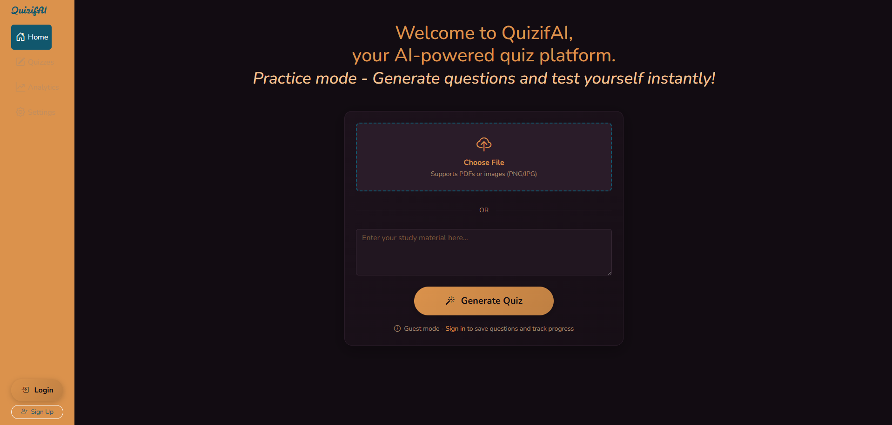

# QuizifAI (Beta)

A modern, AI-powered quiz generation and management platform built with Flask and Google's Gemini AI. Transform your study materials into interactive quizzes with beautiful analytics and progress tracking.

## Access
[Here](https://quizifai-1.onrender.com/)

## Features

### **AI-Powered Question Generation**
- **Smart Content Processing**: Upload PDFs or paste text directly
- **Intelligent Question Creation**: Powered by Google's Gemini AI
- **Multiple Choice Format**: Automatically generates 4-option questions
- **Flexible Input**: Supports study materials, textbooks, notes, and more

### **User Management**
- **Secure Authentication**: Registration and login system
- **Personal Dashboards**: Individual user spaces
- **Guest Mode**: Try the app without creating an account

### **Quiz Management**
- **Create Custom Quizzes**: Organize questions by topic or subject
- **Save Generated Questions**: Build your question bank over time
- **Interactive Quiz Taking**: Clean, distraction-free interface
- **Instant Results**: Immediate scoring and feedback

### **Advanced Analytics**
- **Progress Tracking**: Monitor your learning journey over time
- **Performance Charts**: Beautiful visualizations with Chart.js
- **Quiz-Specific Analytics**: Filter by individual quizzes
- **Comprehensive Stats**: Average scores, best performance, and trends

### **Modern Design**
- **Responsive Layout**: Perfect on desktop, tablet, and mobile
- **Dark Theme**: Easy on the eyes with a professional look
- **Nunito Typography**: Clean, modern font throughout
- **Intuitive UX**: Smooth interactions and animations

## Usage Guide

1. **Get Started**: Register an account or try guest mode
2. **Generate Questions**: Upload study materials or paste text
3. **Review & Save**: Select the best questions for your quizzes
4. **Practice**: Take quizzes to test your knowledge
5. **Track Progress**: View analytics to see your improvement

## Technology Stack

### Backend
- **Flask**: Web framework
- **SQLAlchemy**: Database ORM
- **Flask-Login**: User session management
- **Google Generative AI**: Question generation
- **PyPDF**: PDF text extraction

### Frontend
- **Bootstrap 5**: Responsive CSS framework
- **Alpine.js**: Lightweight JavaScript framework
- **Chart.js**: Data visualization
- **Bootstrap Icons**: Icon library

### Database
- **SQLite**: Development database

*Transform your study materials into engaging quizzes and track your learning progress with AI-powered intelligence.*

